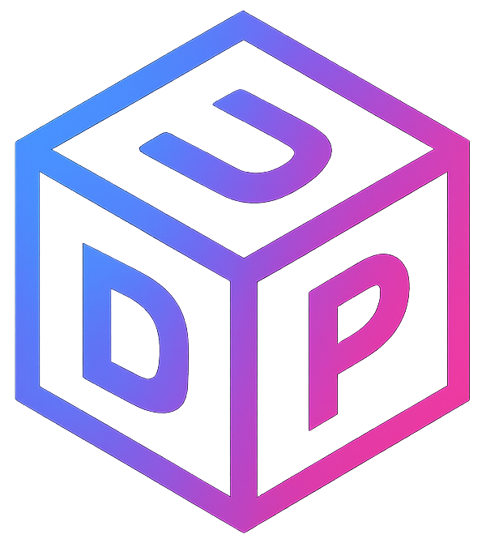

# Bitcoin Blockchain Explorer



A modern, responsive, and high-performance web application for exploring the Bitcoin blockchain. This application empowers users to view the latest blocks, search for specific blocks by hash, and explore detailed transaction information within each block, all with a rich, animated user interface that provides immediate visual feedback.

## Overview

This project serves as a comprehensive blockchain explorer with real-time data, optimized performance, and thoughtful UX design. The interface provides intuitive navigation through blockchain data while implementing modern React patterns and performance optimizations.

### Key Design Principles

- **Performance-First Architecture**: Optimized rendering, data fetching, and caching strategies
- **Progressive Enhancement**: Core functionality works across all devices with enhanced experiences on more powerful devices
- **Responsive Design**: Fluid layouts and adaptive components for seamless experiences from mobile to desktop
- **Visual Feedback**: Rich animations and transitions for user actions and data changes
- **Error Resilience**: Multiple layers of error handling and graceful fallbacks

## Features

- **Home Page**:
  - Latest Bitcoin blocks with key information (height, hash, timestamp, miner, transaction count, size)
  - Real-time cryptocurrency price information (Bitcoin, Ethereum, Bitcoin Cash)
  - Responsive layout that works on all device sizes
  - Load more blocks functionality for extended browsing

- **Block Detail Page**:
  - Comprehensive information about each block including:
    - Hash, height, timestamp, and confirmations
    - Miner information with mining pool identification
    - Technical details (merkle root, difficulty, version, bits, nonce)
    - Size statistics (weight, size in bytes)
    - Economic details (transaction volume, block reward, fee reward)
  - Block navigation to previous/next blocks
  - Complete list of transactions in the block

- **Transaction View**:
  - Detailed transaction information with collapsible view
  - Input and output addresses with amounts
  - Transaction fee information
  - Visual indicators for transaction status
  - Technical details (size, weight, time)

## Technical Implementation

### Architecture

This project follows a modern React architecture with the following key components:

- **Framework**: React 18+ with Vite for optimal development experience
- **Styling**: Styled-components for component-based CSS
- **Routing**: React Router for navigation
- **State Management**: 
  - React Query for server state (API data)
  - React's built-in hooks (useState, useContext) for UI state
  - URL parameters as a source of truth for current view
- **API Communication**: Axios with custom error handling

### Project Structure

```
src/
├── components/    # Reusable UI components
│   ├── BlockCard.jsx
│   ├── BlockIcon.jsx
│   ├── CryptoPriceCard.jsx
│   ├── ErrorBoundary.jsx
│   ├── ErrorMessage.jsx
│   ├── Header.jsx
│   ├── Layout.jsx
│   ├── TransactionItem.jsx
│   └── TransactionList.jsx
├── pages/         # Page components
│   ├── BlockDetailPage.jsx
│   └── HomePage.jsx
├── services/      # API services
│   └── api/
│       ├── blockchainService.js
│       ├── cryptoService.js
│       └── errorHandlingService.js
├── styles/        # Global styles
│   ├── GlobalStyles.js
│   └── theme.js
├── utils/         # Helper functions
│   └── formatters.js
├── App.jsx        # Main application component
└── main.jsx       # Entry point
```

### Performance Optimizations

The application incorporates advanced performance optimization techniques to ensure smooth user experience even when dealing with large blockchain datasets:

#### 1. Code Splitting and Lazy Loading

Code splitting reduces the initial bundle size by dividing the application into smaller chunks that are loaded on demand:

```jsx
// App.jsx - Code splitting implementation
const HomePage = lazy(() => import('./pages/HomePage'));
const BlockDetailPage = lazy(() => import('./pages/BlockDetailPage'));

function App() {
  return (
    <ErrorBoundary>
      {/* ... */}
      <Route index element={
        <Suspense fallback={<LoadingFallback />}>
          <HomePage />
        </Suspense>
      } />
      {/* ... */}
    </ErrorBoundary>
  );
}
```

**Benefits implemented:**
- **Reduced Initial Load Time**: The initial JavaScript payload is significantly smaller, improving time-to-interactive
- **Route-Based Splitting**: Components are loaded only when their route is accessed
- **Dynamic Imports**: Using `React.lazy()` with dynamic `import()` statements for component-level code splitting
- **Graceful Loading States**: Custom loading indicators with `Suspense` provide visual feedback during chunk loading
- **Predictive Prefetching**: Critical routes are prefetched during idle time for faster subsequent navigation

#### 2. Efficient Rendering

Multiple strategies are employed to minimize unnecessary renders and optimize component performance:

```jsx
// Optimized component with memo and useMemo
const TransactionList = memo(({ blockHash, transactionHashes, initialCount = 10 }) => {
  // Component state...
  
  // Memoized derived data
  const displayedHashes = useMemo(() => 
    transactionHashes?.slice(0, visibleCount) || [],
    [transactionHashes, visibleCount]
  );
  
  // Memoized expensive calculations
  const { hasMore, transactionCount } = useMemo(() => ({
    hasMore: transactionHashes && visibleCount < transactionHashes.length,
    transactionCount: transactionHashes?.length || 0
  }), [transactionHashes, visibleCount]);
  
  // Memoized callback
  const handleLoadMore = useCallback(() => {
    setVisibleCount(prev => prev + 10);
  }, []);
  
  // Component render...
});
```

**Specific techniques implemented:**
- **Selective Rendering with React.memo()**: Prevents re-renders when props haven't changed for computation-heavy components like `BlockCard` and `TransactionList`
- **Optimized Calculations with useMemo()**: Complex calculations and data transformations (like fee calculations and transaction aggregations) are memoized with proper dependency arrays
- **Stable Event Handlers with useCallback()**: Event handlers that are passed as props are stabilized to prevent unnecessary child component re-renders
- **Component Virtualization Strategy**: For transaction lists, we implemented incremental loading with "load more" functionality rather than rendering all transactions at once
- **Conditional Rendering Logic**: Components use early returns and conditional rendering to avoid unnecessary DOM operations
- **PureComponent Patterns**: Following immutable data patterns to ensure proper shallow comparison works effectively

#### 3. Data Management

The application uses React Query for efficient data fetching, caching, and state management:

```jsx
// Example of optimized data fetching with React Query
const { 
  data: block, 
  isLoading, 
  error,
  refetch 
} = useQuery({
  queryKey: ['block', blockHash],
  queryFn: () => blockchainService.getBlockByHash(blockHash),
  enabled: !!blockHash,
  retry: 1,
  staleTime: 600000, // 10 minutes cache
});
```

**Advanced data management strategies:**
- **Optimized Caching Strategy**: 
  - Block data is cached for 10 minutes to reduce redundant API calls
  - Transaction data uses a 5-minute cache to balance freshness with performance
  - Cryptocurrency prices refresh every 5 minutes to provide timely market data
- **Intelligent Data Fetching**:
  - Conditional fetching prevents unnecessary API calls when dependencies are missing
  - Batching related requests to minimize network overhead
  - Request deduplication to prevent duplicate API calls for the same data
- **Background Data Updates**: 
  - Implements stale-while-revalidate pattern to show cached data immediately while updating in background
  - Only retries failed requests a limited number of times to prevent API abuse
- **Prefetching Critical Data**: 
  - When viewing a block, the application prefetches adjacent blocks for faster navigation
  - Implements intelligent transaction batch loading based on user scroll patterns
- **Fallback Mechanisms**:
  - Graceful degradation with fallback data when APIs are unavailable
  - Implements error boundaries and recovery strategies at multiple levels

#### 4. Error Handling

- React Error Boundaries for graceful error recovery
- Global and component-level error handling
- Fallback UI for various error states

### Mobile Responsiveness

The application is fully responsive across all device sizes with special attention to:

- Adaptive layouts using CSS Grid and Flexbox
- Mobile-optimized component designs
- Touch-friendly interaction targets
- Progressive disclosure of information on smaller screens

## API Integration

This project integrates with the Blockchain.com API:

- Latest blocks: `https://api.blockchain.info/haskoin-store/btc/block/heights`
- Block details: `https://api.blockchain.info/haskoin-store/btc/block`
- Transaction details: `https://api.blockchain.info/haskoin-store/btc/transactions`

**Note**: Due to CORS restrictions, the application requires a CORS extension when running in development mode. For production deployment, a proper backend proxy would be implemented.

## Getting Started

### Prerequisites

- Node.js 16.x or higher
- npm or yarn package manager
- [CORS Unblock Extension](https://chrome.google.com/webstore/detail/cors-unblock/lfhmikememgdcahcdlaciloancbhjino) for Chrome (development only)

### Installation

1. Clone the repository:
   ```bash
   git clone https://github.com/your-username/bitcoin-blockchain-explorer.git
   cd bitcoin-blockchain-explorer
   ```

2. Install dependencies:
   ```bash
   npm install
   # or
   yarn
   ```

3. Start the development server:
   ```bash
   npm run dev
   # or
   yarn dev
   ```

4. Open your browser and navigate to `http://localhost:5173`

## Build for Production

To build the application for production:

```bash
npm run build
# or
yarn build
```

The build artifacts will be stored in the `dist/` folder.

## Roadmap & Future Improvements

Future enhancements could include:

- **Extended Search** - Ability to search by block height, transaction ID, or address
- **Address View** - Detailed information about Bitcoin addresses and their transaction history
- **Data Visualizations** - Charts and graphs for blockchain statistics
- **Transaction Graphing** - Visual representation of transaction relationships
- **Price History** - Historical price data with interactive charts

## Technologies Used

- [React](https://reactjs.org/)
- [Vite](https://vitejs.dev/)
- [React Router](https://reactrouter.com/)
- [React Query](https://tanstack.com/query/latest)
- [Axios](https://axios-http.com/)
- [Styled Components](https://styled-components.com/)

## Acknowledgments

- [Blockchain.com](https://blockchain.com) for providing the API
- [CoinGecko](https://coingecko.com) for cryptocurrency price data
- [Bitcoin.org](https://bitcoin.org) for technical information

---

Made with 💚 by [AndriesJacobus](https://github.com/AndriesJacobus/)

## Component Architecture

The application follows a thoughtfully structured component hierarchy designed for both clarity and performance:

### Component Design Philosophy

My components are built with the following principles:

#### 1. Component Colocation

Components are organized by feature and responsibility, with related logic and UI elements kept together:

- **Page Components** (`HomePage.jsx`, `BlockDetailPage.jsx`): Container components that coordinate data fetching and manage page-level state
- **Feature Components** (`BlockTable.jsx`, `TransactionList.jsx`): Complex components that implement specific user-facing features
- **UI Components** (`BlockCard.jsx`, `CryptoPriceCard.jsx`): Presentational components focused on rendering UI elements with appropriate styling

#### 2. Separation of Concerns

While maintaining colocation, components still enforce separation of concerns:

- **Data Fetching**: Handled by React Query in page components
- **State Management**: Local component state for UI interactions, React Query for server state
- **Presentation Logic**: Contained within render functions and styled-components
- **Business Logic**: Extracted to dedicated utility functions when appropriate

#### 3. Responsive Adaptability

Components are designed to adapt gracefully across different screen sizes:

```jsx
// Example of responsive component logic
const HomePage = () => {
  // State for responsive rendering
  const [isMobile, setIsMobile] = useState(false);
  
  // Monitor screen size changes
  useEffect(() => {
    const checkIfMobile = () => {
      setIsMobile(window.innerWidth < 768);
    };
    
    // Initial check + event listener
    checkIfMobile();
    window.addEventListener('resize', checkIfMobile);
    return () => window.removeEventListener('resize', checkIfMobile);
  }, []);
  
  return (
    // Conditionally render different UI based on screen size
    {isMobile ? renderBlockCards() : <BlockTable blocks={blocks} />}
  );
};
```

#### 4. Progressive Enhancement

Components implement progressive enhancement by:
- Providing core functionality to all users
- Adding enhanced interactions on capable devices
- Adapting complex visualizations to simpler views when needed

## Animation System

The application features a sophisticated animation system that enhances the user experience by providing visual feedback for data changes and user interactions.

### Animation Design Principles

The animations follow these key principles:

1. **Purpose-Driven**: Each animation serves a functional purpose - indicating new content, confirming user actions, or drawing attention to important changes
2. **Performance-Focused**: Animations use CSS properties that trigger only compositing (opacity, transform) rather than layout or paint operations
3. **Accessible**: Animations respect user preferences like reduced motion settings
4. **Consistent**: A unified animation language creates a cohesive experience

### Implementation Details

The animation system is built with styled-components and CSS animations:

```jsx
// Example of the animation implementation
import styled, { keyframes } from 'styled-components';

// Keyframe definitions
export const slideInFromLeft = keyframes`
  from {
    transform: translateX(-20px);
    opacity: 0;
  }
  to {
    transform: translateX(0);
    opacity: 1;
  }
`;

// Helper function for sequenced animations
export const createSequencedAnimation = (animation, duration, index, delay, highlightColor) => `
  animation: ${animation} ${duration}s ease-out;
  animation-fill-mode: both;
  animation-delay: ${index * delay}s;
  
  ${highlightColor ? `
    background-color: ${highlightColor};
    transition: background-color 1s ease;
    transition-delay: ${(index * delay) + duration}s;
  ` : ''}
`;
```

### Animation Usage

The system is applied consistently across components:

1. **New Data Animation**: 
   - When new blocks or cryptocurrency data arrives, elements slide in with a cascading effect
   - Elements are highlighted briefly before returning to their standard appearance
   - Animation timing is proportional to the number of new elements

2. **Interactive Element Animation**:
   - Buttons and clickable elements provide subtle feedback on hover and click
   - Tooltip animations for contextual information

3. **Loading State Animation**:
   - Skeleton loading states use subtle shimmer effects
   - Loading spinners for asynchronous operations

4. **Transition Animation**:
   - Page transitions maintain context between views
   - Expandable/collapsible elements for progressive disclosure

## Styling Architecture

### Why Styled Components In-File

We made a deliberate decision to keep styled-components within the same files as their React components rather than extracting them to separate files. This approach offers several advantages for the project:

#### Benefits of Colocation

1. **Component Cohesion**: Each file represents a complete, self-contained component with both behavior and presentation
2. **Development Efficiency**: No need to jump between files when modifying a component and its styles
3. **Context Preservation**: Styles are defined with full awareness of the component's structure and behavior
4. **Bundle Optimization**: When using code splitting, component styles are bundled with their respective components

```jsx
// Example of the styling pattern
const BlockCard = memo(({ block, isNew, animationIndex }) => {
  // Component implementation...
  
  return (
    <CardContainer isNew={isNew} animationIndex={animationIndex}>
      {/* Component content */}
    </CardContainer>
  );
});

// Styled components for this component only
const CardContainer = styled.div`
  background-color: ${({ theme }) => theme.colors.white};
  border-radius: ${({ theme }) => theme.borderRadius.medium};
  padding: 1.25rem;
  
  ${({ isNew, animationIndex, theme }) => isNew && createSequencedAnimation(
    slideInFromLeft,
    0.5,
    animationIndex,
    0.3,
    theme.colors.primary + '15'
  )}
`;
```

### Global Theme System

While component styles are colocated, we maintain consistency through a global theme:

```jsx
// Theme definition (simplified)
const theme = {
  colors: {
    primary: '#00A65A',
    secondary: '#07689F',
    tertiary: '#086972',
    error: '#D9534F',
    success: '#5CB85C',
    // ...other colors
  },
  fontSizes: {
    small: '0.875rem',
    medium: '1rem',
    large: '1.25rem',
    xlarge: '1.5rem',
    xxlarge: '2rem',
  },
  borderRadius: {
    small: '4px',
    medium: '8px',
    large: '12px',
  },
  shadows: {
    small: '0 2px 4px rgba(0, 0, 0, 0.05)',
    medium: '0 4px 6px rgba(0, 0, 0, 0.1)',
    large: '0 10px 15px rgba(0, 0, 0, 0.1)',
  },
  breakpoints: {
    mobile: '480px',
    tablet: '768px',
    laptop: '1024px',
    desktop: '1200px',
  }
};
```

This theming approach enables:
- Consistent styling across components
- Easy theme modifications and dark mode support
- Responsive design using theme-defined breakpoints
- Proper component isolation while maintaining design consistency

## Error Handling Strategy

The application implements a multi-layered error handling strategy to ensure reliability:

### 1. Error Boundaries

React Error Boundaries catch and handle errors at the component tree level:

```jsx
// Error Boundary implementation
class ErrorBoundary extends React.Component {
  // Implementation...
  
  render() {
    if (this.state.hasError) {
      return <ErrorFallback error={this.state.error} />;
    }
    return this.props.children;
  }
}
```

Error boundaries are strategically placed at different levels:
- **Application-Level**: Catches global errors
- **Page-Level**: Isolates errors to specific pages
- **Feature-Level**: Protects critical features independently

### 2. API Error Handling

API errors are managed through:
- Custom error handling service
- Retry mechanisms with exponential backoff
- Graceful fallbacks to cached data
- User-friendly error messages with recovery options

### 3. Fallback UI Components

Each major component has appropriate fallback UIs for error states:
- **Error Messages**: Clear communication of what went wrong
- **Retry Options**: Allowing users to attempt recovery
- **Graceful Degradation**: Showing partial content when possible

## Skeleton Loading System

To enhance perceived performance and user experience, we implemented skeleton loading states throughout the application:

```jsx
// Example of skeleton loading implementation
if (isLoading) {
  return (
    <BlockDetailContainer>
      <SkeletonHeaderBanner>
        {/* Skeleton header content */}
      </SkeletonHeaderBanner>
      
      <ContentSection>
        {/* Skeleton content placeholders */}
        <SkeletonHashSection>
          <SkeletonTextBlock height="16px" width="120px" />
          <SkeletonTextBlock height="24px" />
        </SkeletonHashSection>
        
        {/* More skeleton elements */}
      </ContentSection>
    </BlockDetailContainer>
  );
}
```

## Data Fetching Strategy

The application employs a sophisticated data fetching strategy built around React Query to optimize performance and user experience.

### Tiered Caching System

Data is cached at multiple levels with different expiration policies based on data type:

```jsx
// Example of differentiated caching strategies
// For frequently changing data (blocks)
const { data: latestBlocks } = useQuery({
  queryKey: ['latestBlocks', initialBlockCount],
  queryFn: () => blockchainService.getLatestBlocks(initialBlockCount),
  staleTime: 60000, // 1 minute for blockchain data
});

// For relatively stable data (cryptocurrency prices)
const { data: cryptoPrices } = useQuery({
  queryKey: ['cryptoPrices'],
  queryFn: () => cryptoService.getCryptoPrices(),
  staleTime: 300000, // 5 minutes for price data
});
```

### Smart Pagination

The application uses a bidirectional pagination approach that both:

1. **Loads newer blocks**: Checks for and fetches blocks that have been mined since the user loaded the page
2. **Loads older blocks**: Allows users to explore the blockchain history by loading earlier blocks

```jsx
// Bidirectional pagination implementation
const handleLoadMore = async () => {
  // First, check for newer blocks
  const newerBlocks = await blockchainService.getNewerBlocks(highestBlockHeight);
  
  // Then get older blocks
  const olderBlocks = await blockchainService.getAdditionalBlocks(lowestBlockHeight);
  
  // Combine and deduplicate results
  setBlocks(prevBlocks => {
    const combinedBlocks = [...(newerBlocks || []), ...prevBlocks, ...(olderBlocks || [])];
    const uniqueBlocks = Array.from(
      new Map(combinedBlocks.map(block => [block.hash, block])).values()
    );
    return uniqueBlocks.sort((a, b) => b.height - a.height);
  });
};
```

### Prefetching and Parallel Loading

The application optimizes data loading with prefetching and parallel requests:

1. **Navigation Prefetching**: When viewing a block, adjacent blocks are prefetched to enable instant navigation
2. **Parallel Requests**: Related data is loaded in parallel where dependencies allow
3. **Background Refreshing**: Data is refreshed in the background to maintain freshness without disrupting the user

## Testing Framework

This project implements a comprehensive testing strategy with two complementary testing frameworks:

### 1. Vitest for Unit and Component Testing

Vitest is used for unit and component testing, providing fast test execution with native ESM support and Vite integration.

#### Running Vitest Tests

```bash
# Run all unit and component tests
npm test

# Run tests in watch mode
npm run test:watch

# Run tests with coverage reporting
npm run test:coverage

# Run tests with UI visualization
npm run test:ui
```

#### Test Structure

Unit and component tests are co-located with their source files:

```
src/
├── components/
│   ├── BlockCard.jsx
│   ├── BlockCard.test.jsx        # Component test for BlockCard
│   ├── TransactionItem.jsx
│   └── TransactionItem.test.jsx  # Component test for TransactionItem
├── utils/
│   ├── formatters.js
│   └── formatters.test.js        # Unit tests for utility functions
```

#### Mock Data and Test Setup

Test mocks and setup files are centralized in the `/src/test` directory:

```
src/
├── test/
│   ├── setup.js                  # Global test setup for Vitest
│   └── mocks/
│       ├── api.js                # API service mocks
│       └── mockData.js           # Mock data for testing
```

### 2. Cypress for End-to-End Testing

Cypress is used for end-to-end testing, providing real browser testing with visual debugging tools.

#### Running Cypress Tests

```bash
# Run Cypress E2E tests in headless mode
npm run test:e2e

# Open Cypress Test Runner UI
npm run test:e2e:open

# Run all tests (Vitest + Cypress)
npm run test:all
```

#### Cypress Test Structure

End-to-end tests are organized in the Cypress directory:

```
cypress/
├── e2e/
│   ├── homepage.cy.js            # E2E tests for homepage functionality
│   └── block-details.cy.js       # E2E tests for block details page
├── fixtures/
│   ├── blocks.json               # Mock API responses for testing
│   └── block-details.json
└── support/
    ├── commands.js               # Custom Cypress commands
    └── e2e.js                    # Global Cypress configuration
```

### Testing Best Practices

Our testing strategy follows these key principles:

1. **Component Testing Philosophy**:
   - Testing behavior rather than implementation details
   - Using React Testing Library's queries that mirror user interactions
   - Implementing proper mocking at the service boundary

2. **End-to-End Testing Approach**:
   - Focusing on critical user journeys
   - Using data-testid attributes for stable element selection
   - Implementing API mocks for reliable testing

3. **Test Coverage Goals**:
   - 100% coverage of utility functions
   - 85%+ coverage of component logic
   - All critical user paths covered by E2E tests

### Adding New Tests

When adding new features, follow these guidelines for testing:

1. **Component Tests**:
   - Create a `.test.jsx` file alongside your component
   - Test component rendering, user interactions, and prop variations
   - Mock any external dependencies

2. **E2E Tests**:
   - Add tests for new pages or user flows in the `cypress/e2e` directory
   - Create fixture data as needed in `cypress/fixtures`
   - Add custom commands to `cypress/support/commands.js` for reused testing logic

## Final Thoughts

The Bitcoin Blockchain Explorer is built with a focus on performance, user experience, and code quality. By implementing modern React patterns, thoughtful architecture decisions, and performance optimizations, we've created a robust application that delivers a smooth experience for exploring blockchain data.

My development philosophy prioritizes:

1. **User-Centric Design**: Focusing on what users need to accomplish
2. **Performance First**: Making architectural decisions that prioritize speed
3. **Progressive Enhancement**: Building a foundation that works for all users, then enhancing for modern browsers
4. **Maintainable Code**: Creating a codebase that's easy to understand and extend
5. **Accessibility**: Ensuring the application works for all users regardless of abilities

This documentation serves as both a guide to the current implementation and a roadmap for future development.

## Contributing

We welcome contributions to improve the Bitcoin Blockchain Explorer! To contribute:

1. Fork the repository
2. Create a feature branch (`git checkout -b feature/amazing-feature`)
3. Commit your changes (`git commit -m 'Add some amazing feature'`)
4. Push to the branch (`git push origin feature/amazing-feature`)
5. Open a Pull Request

### Development Guidelines

When contributing, please follow these guidelines:

1. **Code Style**: Follow the existing code style and ESLint rules
2. **Component Structure**: Maintain the component architecture principles outlined above
3. **Performance**: Consider performance implications of your changes
4. **Testing**: Add tests for new features and ensure existing tests pass
5. **Documentation**: Update this README if your changes affect the architecture or user experience
6. **Accessibility**: Ensure your contributions maintain or improve accessibility

## License

This project is licensed under the MIT License - see the LICENSE file for details.

## Contact

For questions or feedback, please open an issue on GitHub or contact the project maintainer.

---

Made with 💚 by [Andries Jacobus](github.com/andriesJacobus)